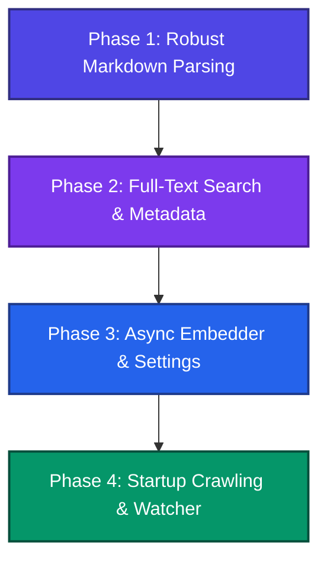

# Knowledge Base: Plan vs. Codebase Comparison

This document provides a comparative analysis between the conceptual backend Rust implementation plan ([knowledge-base-plan-from-claude.md](file:///Users/hudy/ws/depdok/docs/knowledge-base-plan-from-claude.md)) and the current codebase implemented under `src-tauri/src/knowledge_base`.

---

## 1. Overview of Similarities (What is Already Implemented)

A solid foundation for the offline-first local knowledge base is already in place. The core technologies and CRUD endpoints align well with the high-level goals of the plan:

*   **Offline-First Embeddings:** Integrated the `fastembed` crate to run local, private, and fully offline embedding models (`all-MiniLM-L6-v2`) in [fastembed.rs](file:///Users/hudy/ws/depdok/src-tauri/src/knowledge_base/embedding/fastembed.rs).
*   **SQLite Database Engine:** Set up the database storage and lifecycle in [db.rs](file:///Users/hudy/ws/depdok/src-tauri/src/knowledge_base/db.rs).
*   **Vector Database Support:** Configured the `sqlite-vec` extension and initialized the vector virtual table `documents_embeddings`.
*   **Core CRUD Tauri Commands:** Implemented crucial Tauri IPC commands in [commands.rs](file:///Users/hudy/ws/depdok/src-tauri/src/knowledge_base/commands.rs), including:
    *   `insert_or_replace_document` (indexing text chunks)
    *   `delete_document` (cleaning up both document text and associated vector entries)
    *   `get_document` (retrieval)
    *   `search_similar` (vector similarity KNN search)
*   **Automatic Sync Hooks on Save:** Auto-sync hooks are registered in [files.rs](file:///Users/hudy/ws/depdok/src-tauri/src/commands/files.rs) to intercept file writes (`write_file_content`) and file creations (`create_file`). These schedule debounced (500ms) indexing runs on modified `.md` files.
*   **Unit Tests:** Configured an in-memory testing framework in [internal_commands.rs](file:///Users/hudy/ws/depdok/src-tauri/src/knowledge_base/tests/internal_commands.rs) to verify state updates, document indexing, and relationship linking without mutating the disk.

---

## 2. Key Architectural Deviations

The current codebase differs from the plan in a few key architectural areas, often improving on performance or structure:

| Architectural Component | Plan Proposal | Current Implementation | Implications & Rationale |
| :--- | :--- | :--- | :--- |
| **Vector Engine** | Standard SQL BLOBs for `f32` arrays + custom cosine similarity. | Native vector virtual tables (`vec0`) via `sqlite-vec` library. | **Improvement:** `sqlite-vec` provides fast, hardware-accelerated vector similarity queries directly within SQLite using the standard `MATCH` syntax, eliminating the need to write custom pooling or distance calculations in Rust. |
| **Markdown Chunking Scope** | A flat `notes` table with multiple vector fragments registered in `chunks`. | Document splitting into hierarchical sub-documents/sections in [markdown_chunking/mod.rs](file:///Users/hudy/ws/depdok/src-tauri/src/knowledge_base/markdown_chunking/mod.rs). | **Different Design:** The codebase splits markdown files into sub-documents at heading boundaries (e.g. `file.md#section:slug`), and treats each section as a first-class `document` in the database. Each section is then chunked and embedded separately. |
| **Graph Modeling** | Explicit `links` and automatic `semantic_links` tables. | A single polymorphic `edges` table (source, target, optional type). | **Simplified Design:** The codebase models relationships generally as edges. Automatic semantic links are not currently stored in a separate table, and relationships rely on manual connections (`connect_to`). |
| **Model Loader Runtime** | Manual HuggingFace folder resolution using `ort` (ONNX Runtime) + `tokenizers` configuration. | Out-of-the-box loading via the `fastembed` crate. | **Improvement:** `fastembed` manages the underlying ONNX runtime and tokenization pipeline automatically, minimizing boilerplate and managing local model downloads/caching seamlessly. |

---

## 3. Gaps & Areas to Improve (What is Missing)

Several advanced features detailed in the plan are currently missing or need refinement in the codebase:

### A. Graph Extraction & Metadata (Links / Tags)
*   **Automatic Tag Extraction:** The plan specifies extracting `#tags` from note contents into a `tags` database table on every save to build filters and node coloring in the graph. The codebase has no tag parsing or storage.
*   **Automatic Wikilink Extraction:** The plan calls for extracting `[[wikilinks]]` and standard markdown links `[label](path)` into a links database. The codebase currently requires manual registration of connections via the `connect_to` command.
*   **Markdown Parsing Engine:** The plan specifies using `pulldown-cmark` (a highly robust CommonMark parser) to extract tags, headers, and links. The current implementation uses custom line-by-line regex scanning (`parse_markdown_heading`) which is prone to false positives/negatives in complex markdown.

### B. Syncing & File Management
*   **Workspace Crawling (Startup Sync):** The plan describes using `walkdir` to traverse the workspace directory on startup, comparing file modification timestamps (`mtime`) with database records, and indexing modified files. The current codebase has no startup scan or `mtime`/`indexed_at` database fields.
*   **Filesystem Watcher:** The plan includes a filesystem watcher (`notify` crate) to update the database automatically when notes are changed externally. Currently, the app registers a file watcher in `lib.rs` (`commands::file_watcher::start_watching`), but it is not connected to the knowledge base indexing pipeline.
*   **Clean Incremental Indexes:** Because the codebase lacks `mtime` checking, it cannot perform incremental updates. Any rebuild requires wiping and re-indexing everything from scratch.

### C. Search Enhancement (FTS5)
*   **FTS5 Full-Text Search Integration:** The plan proposes a content-managed FTS5 virtual table (`notes_fts`) with triggers automatically syncing content updates. This allows hybrid keyword + vector searches. The codebase currently lacks keyword/FTS search indexing.

### D. Settings & Embedder Configuration
*   **Dynamic Embedder Switching:** The plan details storing an `embedder_config` table and a `model_paths` table in the DB, allowing the user to dynamically switch between local models (MiniLM, BGE, E5, Nomic) and API-based models (OpenAI) at runtime. The codebase has a hardcoded configuration locked to `fastembed`'s `all-MiniLM-L6-v2`.
*   **Asynchronous Embedding Operations:** The plan's `Embedder` trait uses `async-trait` to ensure network-bound requests (e.g. OpenAI embeddings) do not block execution threads. The codebase uses a synchronous `fn embed(&self, text)` trait method, which will block threads during network requests in the compile-time scaffolded `OpenAiProvider`.
*   **Secure API Key Storage:** The plan specifies storing the OpenAI API key securely in the OS keyring using the `keyring` crate. The codebase has a `keyring` implementation for license keys in `keychain.rs`, but has left OpenAI key storage as a `TODO` in `init_embedder`.

---

## 4. Status Explanation and Task List

### Why Certain Tasks are Checked
*   **SQLite Database Setup:** The core database schema and initialization logic are fully implemented in [db.rs](file:///Users/hudy/ws/depdok/src-tauri/src/knowledge_base/db.rs).
*   **Vector Search Engine (`sqlite-vec`):** The codebase loads and runs the `sqlite-vec` extension via standard auto-extension registration, exposing vector operations through `MATCH`.
*   **Local Embedding Provider:** The `fastembed` crate is integrated to retrieve embeddings without having to orchestrate ONNX/Tokenizer files manually.
*   **Tauri Integration & IPC:** Tauri commands for CRUD operations (`insert_or_replace_document`, `delete_document`, `get_document`, `search_similar`) are exposed and wired to the frontend.
*   **Auto-Sync Hooks:** Document saves triggered by writing to files are intercepted and synced automatically with a 500ms debounce.
*   **In-Memory Testing:** A robust suite of tests in [internal_commands.rs](file:///Users/hudy/ws/depdok/src-tauri/src/knowledge_base/tests/internal_commands.rs) validates core logic using in-memory databases.

### Why Certain Tasks are Unchecked
*   **Metadata Extraction (Tags & Links):** The database lacks separate tables for `tags` and `links` to support auto-indexing tags (`#tag`) and explicit markdown/wikilinks (`[[link]]`). Currently, graph edges must be connected manually.
*   **CommonMark Parsing (`pulldown-cmark`):** Heading parsing uses regex scanners on a line-by-line basis, which is fragile. Using `pulldown-cmark` is needed to handle full CommonMark spec parsing for headers, inline links, and tag delimiters.
*   **Full-Text Search (FTS5):** A content-less FTS5 virtual table for hybrid semantic/keyword search is not implemented.
*   **Incremental Sync & File Crawling:** The database doesn't track file modification times (`mtime` / `indexed_at`). We need startup crawlers (`walkdir`) and filesystem watch handlers (`notify` events) hooked to the indexing pipeline to avoid full rebuilding of the index on every update.
*   **Dynamic Config & Settings UI:** Configuration is currently hardcoded to `fastembed`'s default model (`all-MiniLM-L6-v2`) and the `OpenAiProvider` is compile-time gated and synchronous, lacking keyring storage and dynamic config tables (`embedder_config`, `model_paths`).

### Compliance Checklist

#### Core Infrastructure
- [x] Initialize SQLite database in the standard OS App Data directory.
- [x] Configure vector search support natively using the `sqlite-vec` extension.
- [x] Implement local offline embedding execution using the `all-MiniLM-L6-v2` model.
- [x] Expose Tauri IPC commands for Document CRUD operations and manual graph connecting.
- [x] Add automated unit tests with mock embedding providers and in-memory databases.

#### Markdown Chunking & Parser
- [x] Chunk document text using character boundaries with overlap windowing.
- [x] Segment markdown content into sub-documents/sections by headings.
- [ ] Implement `pulldown-cmark` to reliably parse CommonMark documents.
- [ ] Auto-extract `#tags` from markdown content during indexing.
- [ ] Auto-extract `[[wikilinks]]` and standard markdown links `[label](path)` to build graph edges dynamically.

#### Syncing & Lifecycle
- [x] Run debounced auto-indexing hooks on file saves/creates from within the app.
- [ ] Track file modification times (`mtime` and `indexed_at`) in the database to prevent duplicate work.
- [ ] Implement a startup crawl utilizing `walkdir` to perform incremental index updates for files modified since the last session.
- [ ] Connect the external filesystem watcher (`notify` events) directly into the knowledge base indexing pipeline to sync external edits.

#### Search Enhancements
- [ ] Create content-managed FTS5 virtual table synced via SQL database triggers.
- [ ] Implement a hybrid keyword-semantic search query combining FTS results with KNN vector distance.

#### Dynamic Model Settings
- [ ] Refactor the `Embedder` trait to be async (`async fn embed`) to prevent blocking during network requests.
- [ ] Implement the singleton `embedder_config` database table to support switching between local and API-based models at runtime.
- [ ] Implement the `model_paths` database table to allow custom local ONNX folders.
- [ ] Integrate secure OpenAI API key storage in the system keychain using `keyring`.

---

## 5. Recommended Action Plan

To bridge the gap between the current codebase and the target architecture, we recommend the following phases:

### Phase 1: Robust Markdown Parsing (pulldown-cmark)
*   Replace custom heading scanners with `pulldown-cmark` in a new parser module.
*   Implement automatic extraction of tags (`#tag`) and links (`[[wikilink]]` and markdown links).
*   Populate `tags` and `links` database tables on document save, automatically populating graph nodes/edges.

### Phase 2: Full-Text Search (FTS5)
*   Implement the FTS5 virtual table (`documents_fts`) and setup database triggers on the `documents` table.
*   Expose a hybrid search Tauri command that combines FTS keyword matches with semantic vector distances (Reciprocal Rank Fusion or weighted scores).

### Phase 3: Async Embedder & Dynamic Configuration
*   Refactor the `Embedder` trait to be async (`async fn embed`).
*   Migrate the database to include the singleton `embedder_config` and `model_paths` tables.
*   Wire the keyring crate to store and fetch the OpenAI API key securely.
*   Expose settings commands so users can download models, select custom local ONNX folders, or supply an OpenAI key.

### Phase 4: Startup Scan & Watcher Integration
*   Introduce `mtime` and `indexed_at` columns in the database.
*   Implement a startup directory crawler using `walkdir` to perform fast, timestamp-based incremental updates.
*   Hook the workspace filesystem watcher (`notify` events) directly into the knowledge base indexing pipeline.
