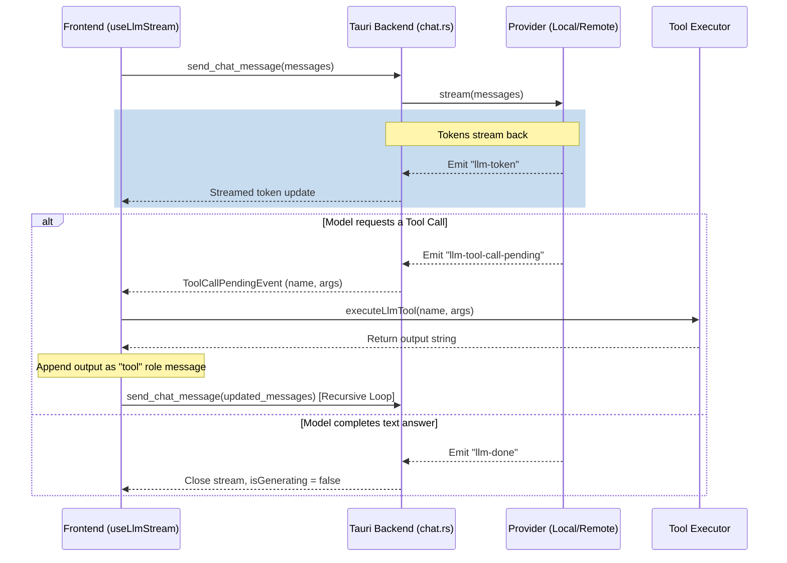

# LLM & AI Chat Integration

Depdok features a local-first AI assistant capable of answering questions about the codebase, reading/writing files, executing shell commands, and searching the web. It supports both offline execution of GGUF models (via `llama.cpp`) and remote API providers (OpenAI, Claude, Ollama, LM Studio).

---

## 📂 Code Structure

### 1. Tauri Backend (`src-tauri/src/llm/`)

The LLM backend is modularized to separate configuration settings, execution engines, chat logic, and tools.

*   **`mod.rs`**: Core module registration and entry points.
*   **`providers/`**: Encapsulates LLM inference engines under a unified `LlmProvider` trait.
    *   [`local.rs`](file:///Users/hudy/ws/depdok/src-tauri/src/llm/providers/local.rs): Manages offline inference using `llama.cpp` for GGUF models. Implements string-level tool-call parsers to translate GGUF instruction-formatting into structured tool executions.
    *   [`openai.rs`](file:///Users/hudy/ws/depdok/src-tauri/src/llm/providers/openai.rs): Client for OpenAI-compatible endpoints.
    *   [`claude.rs`](file:///Users/hudy/ws/depdok/src-tauri/src/llm/providers/claude.rs): Client for Anthropic Claude.
    *   [`ollama.rs`](file:///Users/hudy/ws/depdok/src-tauri/src/llm/providers/ollama.rs): Client for Ollama local servers.
    *   [`lm_studio.rs`](file:///Users/hudy/ws/depdok/src-tauri/src/llm/providers/lm_studio.rs): Client for LM Studio local servers.
*   **`settings/`**: Handles configuration setup and local model files.
    *   [`config.rs`](file:///Users/hudy/ws/depdok/src-tauri/src/llm/settings/config.rs): Saves and loads LLM credentials and provider types.
    *   [`provider.rs`](file:///Users/hudy/ws/depdok/src-tauri/src/llm/settings/provider.rs): Tracks, loads, and unloads active providers in memory.
    *   [`models.rs`](file:///Users/hudy/ws/depdok/src-tauri/src/llm/settings/models.rs): Manages GGUF downloads and scanning.
*   **`chat/`**: Implements interactive chat messaging and session persistence.
    *   [`chat.rs`](file:///Users/hudy/ws/depdok/src-tauri/src/llm/chat/chat.rs): Dispatches chat prompts to active providers and streams tokens.
    *   [`session.rs`](file:///Users/hudy/ws/depdok/src-tauri/src/llm/chat/session.rs): Persists chat histories locally to `.depdok/chat/<session_id>/history.json` inside the workspace.
*   **`commands/`**: Integrates LLM features outside of the main panel.
    *   [`grammar.rs`](file:///Users/hudy/ws/depdok/src-tauri/src/llm/commands/grammar.rs): Isolated LLM correction utility for TipTap selection bubble menus.
*   **`tools/`**: Interfaces that the AI assistant can invoke dynamically.
    *   [`mod.rs`](file:///Users/hudy/ws/depdok/src-tauri/src/llm/tools/mod.rs): Schema definitions and router execution.
    *   [`fs.rs`](file:///Users/hudy/ws/depdok/src-tauri/src/llm/tools/fs.rs): Workspace file reading, writing, and directory listing.
    *   [`shell.rs`](file:///Users/hudy/ws/depdok/src-tauri/src/llm/tools/shell.rs): Workspace-sandboxed terminal command execution.
    *   [`yahoo.rs`](file:///Users/hudy/ws/depdok/src-tauri/src/llm/tools/yahoo.rs): Web search scraper utilizing Yahoo Search (immune to DuckDuckGo CAPTCHAs).

---

### 2. React Frontend (`src/features/LLMChat/`)

The frontend manages user interaction, settings configurations, and coordinate-loops for tool executions.

*   [`api/llm.ts`](file:///Users/hudy/ws/depdok/src/features/LLMChat/api/llm.ts): Wrapper client dispatching Tauri IPC commands and subscribing to event listeners.
*   [`store/LLMChatStore.ts`](file:///Users/hudy/ws/depdok/src/features/LLMChat/store/LLMChatStore.ts): Jotai atoms defining global generating states, message lists, and session IDs.
*   [`hooks/useLlmStream.ts`](file:///Users/hudy/ws/depdok/src/features/LLMChat/hooks/useLlmStream.ts): Stream controller orchestrating recursive tool execution loops.
*   **`components/`**:
    *   `LLMChatPanel.tsx`: floating sliding assistant panel.
    *   `LLMChatMessage.tsx`: Renders Markdown bubbles and execution indicators.
    *   `LLMChatInput.tsx`: Custom text area and stop buttons.
    *   `settings/LLMModelSetting.tsx`: Provider configuration tab.

---

## 🔄 How it Works

### LLM Stream Event Cycle

When a user submits a message, the following recursive execution lifecycle occurs:



### Prompt Context Formatting (Local Models)

To support multi-turn conversation and tool calling locally (without native structured schemas), [`local.rs`](file:///Users/hudy/ws/depdok/src-tauri/src/llm/providers/local.rs) compiles the message arrays into a unified instruction chain:

```
<|system|>
You are a helpful AI assistant integrated into a code editor.
<|user|>
Search this repository
<|assistant|>
<|tool_call>web_search{"query":"..."}<tool_call|>
<|tool_response>{"results": [...]}
<|assistant|>
Based on the results, here is your answer...
```

The GGUF engine reads `<|tool_response|>` messages to understand that a tool was already run, preventing loops and allowing it to produce final answers.
