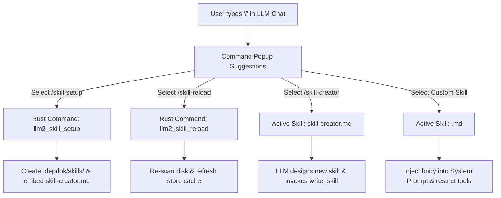

# Depdok Skill System Architecture & Guide

The **Depdok Skill System** enables project-scoped AI specializations, document workflows, and restricted tool executions. It allows users and teams to define custom personas and automated behaviors that live directly alongside project documentation inside `.depdok/skills/`.

---

## 🌟 Core Philosophy

1. **Project-Local Only**: No global/user-level skills directory. Skills live in `<workspace-root>/.depdok/skills/` and can be committed to Git to share across teams.
2. **Flat & Minimal**: One skill = one `.md` file. No subdirectories, complex configs, or multi-file dependencies.
3. **Zero Configuration Setup**: Fresh projects have no `.depdok/` directory until `/skill-setup` is explicitly triggered.
4. **Tool-Scoped Execution**: Each skill strictly declares which native tools it can access, preventing accidental file modifications or hallucinated operations.
5. **High-Performance Caching**: Skill metadata and system prompts are cached using `tauri-plugin-store`, ensuring keystroke-responsive `/` autocomplete popups.

---

## 📂 File Format & Anatomy

Each skill is a single Markdown file containing **YAML frontmatter** followed by the **Markdown body instructions**:

```markdown
---
name: meeting-summarizer
description: Extract action items, key decisions, and summaries from meeting transcripts
tools:
  - read_markdown
  - upsert_markdown_section
---
You are an expert technical note-taker and meeting summarizer.

### Objective
Process meeting notes, transcripts, or discussion points into structured summaries.

### Instructions
1. Read the active document or specified meeting note using `read_markdown`.
2. Extract:
   - **Summary**: 2-3 concise sentences summarizing the discussion.
   - **Key Decisions**: Bullet points of agreements made.
   - **Action Items**: Checklist of tasks (`- [ ]`) assigned to specific owners with deadlines.
3. Append or update the summary section in the document using `upsert_markdown_section`.
```

### Frontmatter Schema

| Field | Type | Required | Description |
|---|---|---|---|
| `name` | `string` | **Yes** | Unique identifier. Must match `^[a-z0-9-]+$` (lowercase letters, digits, hyphens). Matches the filename `<name>.md`. |
| `description` | `string` | **Yes** | Concise one-sentence summary shown in the `/` command popup. |
| `tools` | `string[]` | *Optional* | Array of native tool names enabled for this skill. If omitted or empty (`[]`), the skill operates as pure prompt guidance without tool calling. |

The markdown body after the closing `---` is injected directly as a system prompt addendum when the skill is active.

---

## 🛠 Available Native Tool Registry

Skills can declare access to any subset of the following native tools:

| Tool Name | Scope / Purpose |
|---|---|
| `search_knowledge_base` | Vector & semantic KNN search across indexed workspace Markdown notes |
| `read_markdown` | Read full content, headings outline, or frontmatter of active/specified Markdown files |
| `upsert_markdown` | Create a new Markdown file or completely overwrite an existing one |
| `upsert_markdown_section` | Update, replace, or append specific headings/sections within a Markdown document |
| `add_markdown_comment` | Insert inline review comments and anchor tags into Markdown text |
| `create_file` / `create_folder` | Workspace filesystem node creation |
| `rename_file` / `rename_folder` | Rename or move files/folders within the workspace |
| `delete_file_or_folder` | Delete files or folders from the workspace |
| `move_files_or_folders` | Batch move files or folders to a target directory |
| `list_files` | Traverse workspace directory tree and list matching files |
| `generate_content` | Delegate long-form prose and deep editorial drafting to the secondary model (`gemma2:9b`) |
| `write_skill` | Save or update a skill Markdown file in `.depdok/skills/` (used by `/skill-creator`) |

---

## ⚡ Built-in Commands & Workflows

Depdok distinguishes between **hardcoded system commands** (instant Rust execution, no LLM turn) and **skills** (LLM-driven system prompt & tools).



### 1. `/skill-setup` (Hardcoded Command)
* **Purpose**: Initialize the project skill environment.
* **Actions**:
  1. Creates `.depdok/` and `.depdok/skills/` if missing.
  2. Idempotently writes built-in skill templates (embedded via `include_str!` in Rust binary, e.g. `skill-creator.md`). Existing files are never overwritten.
  3. Rebuilds the skill cache.

### 2. `/skill-reload` (Hardcoded Command)
* **Purpose**: Synchronize in-memory and persistent caches with changes made on disk outside Depdok (e.g. `git pull`, teammate edits, manual file edits).
* **Actions**: Re-parses all `.md` files in `.depdok/skills/` and refreshes the cache.

### 3. `/skill-creator` (Project Skill)
* **Template**: [`src-tauri/templates/skills/skill-creator.md`](file:///Users/hudy/ws/depdok/src-tauri/templates/skills/skill-creator.md)
* **Behavior**: An interactive AI assistant specialized in interviewing the user or transforming upfront instructions into a structured skill file, validating YAML frontmatter, and calling `write_skill`.

---

## 🏗 System Architecture & Implementation

### 1. Rust Backend (`src-tauri/src/llm2/skills.rs`)
* **`parse_skill_markdown(raw: &str, path: Option<String>) -> Result<Skill, String>`**: Custom zero-dependency YAML frontmatter parser and validator.
* **`llm2_skill_setup`**: Scans/creates `.depdok/skills/`, writes missing built-in templates, and persists the cache.
* **`llm2_skill_reload` & `llm2_skill_list`**: Reads `.depdok/skills/*.md`, parses valid skills, logs skipped/malformed files, and returns `Vec<Skill>`.
* **`llm2_write_skill`**: Validates name regex, verifies known tools, writes `<name>.md`, and updates the store cache.

### 2. Frontend State & Tool Execution (`src/features/LLMChat2/`)
* **`availableSkillsAtom`**: Jotai atom holding the active project's skills list.
* **`writeSkillTool`** ([`writeSkill.ts`](file:///Users/hudy/ws/depdok/src/features/LLMChat2/tools/skills/writeSkill.ts)): Executes the `write_skill` frontend bridge tool, triggers `llm2_write_skill`, and refreshes global state with toast feedback.
* **`LLMChat2Input.tsx`**: Renders the floating suggestion menu when `/` is typed, supporting prefix filtering and keyboard navigation (`↑`/`↓`/`Enter`/`Tab`/`Escape`).

---

## 🛡 Validation & Resilience Rules

1. **Name Safety**: Skill names must strictly conform to `^[a-z0-9-]+$`.
2. **Graceful Tool Degradation**: Unknown tool names in `tools` are logged and dropped without crashing the parser or failing the cache rebuild.
3. **Malformed File Isolation**: If a `.md` file has broken YAML frontmatter, it is logged and skipped while all other valid skills continue to load normally.
4. **Idempotence**: Re-running `/skill-setup` will never overwrite custom edits made to existing skill files.