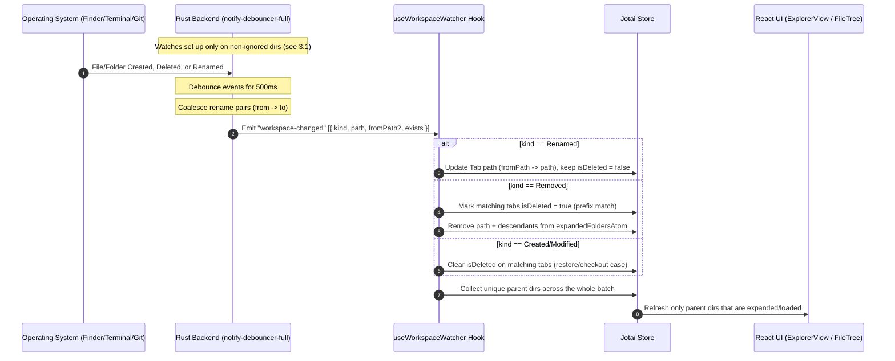
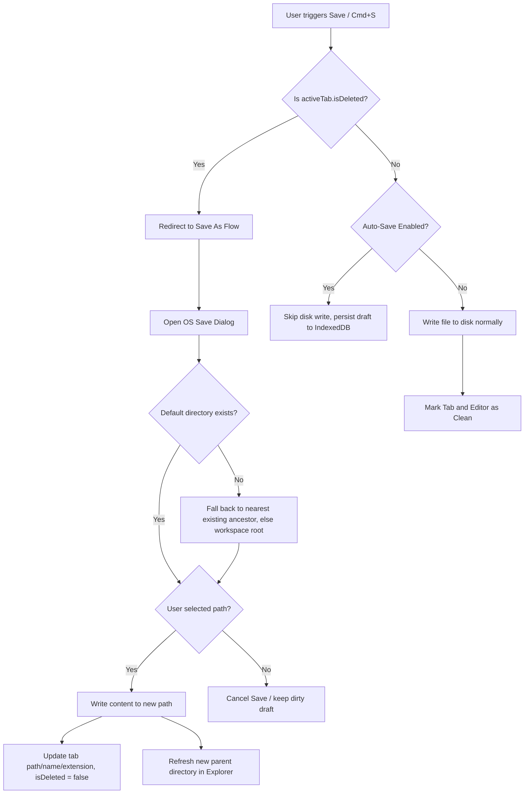

# Real-Time Workspace File Watcher & Deleted Tab Handler

**Status:** Draft for review
**Scope:** Tauri/Rust backend file watching, real-time explorer sync, ghost-tab (deleted file) handling

## 1. Goals

- Watch the open workspace directory recursively from Rust and push changes to the frontend in real time.
- Keep the file explorer in sync (creates, deletes, renames) without polling.
- When a file or its parent folder is deleted while open in a tab, visually mark the tab and force a "Save As" flow instead of silently failing to write.
- Do all of this without degrading performance on large repos (node_modules-sized trees).

## 2. Architecture

### 2.1 Real-Time Watcher Flow

### 2.2 Save Flow for Deleted (Ghost) Tabs

## 3. Performance & Correctness Strategy

### 3.1 Filter at watch-setup time, not just at emit time

Recursive watch registration (especially `inotify` on Linux) creates one OS watch descriptor per directory. Filtering events after they're generated doesn't stop watches from being placed inside `node_modules`, `.git`, `target`, etc. — which is where the highest event volume and largest directory counts live.

- Walk the tree manually when building the watch set.
- Skip adding a watch for any directory matching the ignore list (`.git`, `node_modules`, `target`, `.next`, `dist`, `build`, and anything starting with `.`) **before** registering it.
- Re-apply this check when new directories appear, so a freshly created `node_modules` doesn't get watched mid-session.
- Keep the ignore list user-configurable later (e.g. respecting `.gitignore`) — out of scope for v1 but worth a TODO.

### 3.2 500ms debouncing + rename coalescing

- Use `notify-debouncer-full`, which exposes coalesced rename pairs as `(from, to)` rather than separate remove/create events.
- Debounce window stays at 500ms to absorb event storms from `git checkout`, builds, or bulk installs.

### 3.3 Batch-level dedup before refreshing

- A single debounced batch can span many directories (e.g. `git checkout` touching 50 files).
- Collect all affected parent directories into a `HashSet`/`Set` first, then issue one `refreshDirectoryAtom` per unique parent — never per raw event.
- Only refresh a parent if it's already loaded/expanded in `fileTreeDataAtom` (unchanged from original plan — this part was already correct).

### 3.4 Lazy / scoped watching for large repos

- Watching the entire workspace root recursively up front can register tens of thousands of descriptors on a large monorepo even after excluding `node_modules` and `.git`.
- v1: recursive watch on workspace root minus ignored dirs (simplest, matches original plan).
- Flag for follow-up: if real-world repos show high watch counts or memory pressure, switch to watching only the root + currently expanded folders, adding/removing watches as folders expand/collapse. Benchmark before deciding this is needed — don't build it speculatively.

### 3.5 OS-specific backends

- macOS: FSEvents backend (bypasses per-folder watch limits, low memory footprint). Note FSEvents can report only the top-level path for a deleted folder, not every descendant — this is why prefix-matching in 3.6 is required, not optional.
- Linux: inotify — sensitive to `fs.inotify.max_user_watches`; this is the main reason 3.1 matters.
- Windows: ReadDirectoryChangesW via `notify`'s backend — case-insensitive paths, different separator, see 3.6.

### 3.6 Cross-platform path matching

- Normalize path separators (`\` vs `/`) before any comparison.
- Treat paths case-insensitively on macOS/Windows defaults, case-sensitively on Linux (or canonicalize and compare canonical forms where possible).
- Canonicalize paths where feasible to avoid symlink-driven duplicate matches or accidental watch loops.
- "Tab is under deleted path" = exact match OR path starts with `deletedPath + separator` (prefix match) — needed because folder deletes may only emit one event for the top directory.

### 3.7 Watcher lifecycle

- Store the active watcher behind `Mutex<Option<Watcher>>` (or equivalent) in `WorkspaceWatcher` state.
- `start_watching_workspace` must first tear down any existing watcher before starting a new one, so switching workspaces mid-session doesn't leak threads or watch handles.
- `stop_watching_workspace` drops the watcher and joins/aborts the debouncer thread cleanly.

## 4. Proposed Changes

### 4.1 Rust Backend

#### [MODIFY] `src-tauri/src/commands/file_watcher.rs`
- Define `WorkspaceWatcher` struct (holds `Mutex<Option<Debouncer<...>>>`).
- Define `WorkspaceChangeEvent { kind: ChangeKind, path: String, from_path: Option<String>, exists: bool }` where `ChangeKind` is `Created | Modified | Removed | Renamed`.
- Implement `start_watching_workspace(workspace_root: String, app: AppHandle)`:
  - Tear down any prior watcher (3.7).
  - Manually walk the tree, registering watches only on non-ignored directories (3.1).
  - Spawn debounced watcher thread (`Duration::from_millis(500)`).
  - Coalesce rename events into `Renamed { from, to }` pairs where the backend supports it; otherwise fall back to remove+create heuristics.
  - Dedup parent directories per batch before emitting (3.3) — emit the raw per-path list but let the frontend do final dedup, or dedup here; pick one layer and document it (recommend: Rust emits raw list, frontend dedups, since Rust doesn't know expanded-folder state anyway).
  - Emit `"workspace-changed"` with the event batch.
- Implement `stop_watching_workspace(app: AppHandle)`.

#### [MODIFY] `src-tauri/src/lib.rs`
- Register `commands::file_watcher::WorkspaceWatcher::new()` in `setup`.
- Register `start_watching_workspace` / `stop_watching_workspace` in `invoke_handler`.

#### [VERIFY] `src-tauri/tauri.conf.json` (or capabilities file)
- Confirm fs capabilities allow recursive read access to arbitrary user-opened folders — continuous watching is broader access than one-off reads, and may need an explicit capability entry rather than relying on whatever scope was set up for single-file operations.

### 4.2 Frontend

#### [MODIFY] `src/lib/fileWatcher.ts`
- Add wrappers: `startWatchingWorkspace`, `stopWatchingWorkspace`, `onWorkspaceChanged` listener.
- Define matching TS types for `WorkspaceChangeEvent` / `ChangeKind`.

#### [MODIFY] `src/stores/TabStore.ts`
- Extend `Tab` with `isDeleted?: boolean`.
- `updateTabPathAtom` sets `isDeleted: false` whenever a path is updated (covers both Save As and rename-driven path updates).

#### [NEW] `src/hooks/useWorkspaceWatcher.ts`
- Lifecycle: start watcher when `workspaceRootAtom` is set, stop on unmount/change.
- On each `"workspace-changed"` batch:
  - Normalize all paths (separator + case rules per 3.6).
  - Partition events by `kind`.
  - **Renamed**: update any open tab whose path matches `fromPath` (or is a descendant of it) to the new `path`, preserving relative subpath for descendants of a renamed folder. Do **not** mark `isDeleted`.
  - **Removed**: prefix-match against open tabs → set `isDeleted: true`. Remove the path and any descendant paths from `expandedFoldersAtom`.
  - **Created/Modified**: prefix-match against open tabs currently marked `isDeleted` → clear the flag (covers git checkout / external restore).
  - Compute the unique set of parent directories across the whole batch, then call `refreshDirectory(parentDir)` once per unique parent, only if that parent is already loaded in `fileTreeDataAtom`.

#### [MODIFY] `src/pages/Editor.tsx`
- Call `useWorkspaceWatcher()` in the main `Editor` component.

#### [MODIFY] `src/features/EditorTabs/TabItem.tsx`
- Apply `line-through opacity-50 text-destructive` to the file name when `tab.isDeleted`.
- Add a tooltip/indicator explaining the file was deleted externally.

#### [MODIFY] `src/features/Editor/EditorSaveHandler.tsx`
- In `handleSave`, if `activeTab?.isDeleted`, redirect to `handleSaveAs`.
- In `handleSaveAs`, default dialog directory: original parent if it still exists, else walk up to the nearest existing ancestor, else workspace root (see flow 2.2).

#### [MODIFY] `src/features/Editor/useAutoSave.ts`
- Skip disk write when `activeTab?.isDeleted`; still persist the draft to IndexedDB so the tab stays recoverable and visibly dirty.

## 5. Edge Cases Checklist

- [ ] Renaming an open file updates its tab path without triggering the ghost/Save-As flow.
- [ ] Renaming a folder containing open files updates all descendant tab paths.
- [ ] Deleting a folder with many open files marks all of them `isDeleted`, not just direct children.
- [ ] `git checkout` that deletes-then-recreates a tracked file clears `isDeleted` rather than leaving a stale ghost tab.
- [ ] Switching workspaces mid-session stops the old watcher (no duplicate events, no leaked threads).
- [ ] Large repo (with real `node_modules`/`.git` on disk) doesn't trip OS watch limits.
- [ ] Save As default directory falls back gracefully when the original folder no longer exists.
- [ ] Path matching is correct on Windows (case-insensitive, `\` separators) and Linux (case-sensitive).

## 6. Verification Plan

### Automated
- `cargo build` / `cargo check` — no Rust compilation errors.
- `tsc --noEmit` — no TypeScript errors.
- Unit test: prefix-matching logic against a table of (deletedPath, tabPath, expectedMatch) cases covering separators/case.

### Manual
1. **Explorer sync**: open a workspace, create/delete files and folders externally, confirm explorer updates within ~500ms without manual refresh.
2. **Rename handling**: rename an open file externally; confirm the tab follows the rename and does *not* show strike-through.
3. **Delete + ghost tab**: delete an open file (or its parent folder) externally; confirm strike-through appears, editing still works, and Cmd+S routes to Save As.
4. **Save As recovery**: complete the Save As flow; confirm tab path/name/extension update and strike-through clears.
5. **Restore case**: delete a tracked file then `git checkout` it back; confirm the ghost state clears automatically.
6. **Large repo stress test**: open a real-world monorepo with `node_modules` present, monitor CPU/memory and confirm no watch-limit errors in the Rust logs.
7. **Workspace switch**: open workspace A, then open workspace B without closing the app; confirm only B's changes trigger events.

## 7. Open Questions / Pre-Build Spike

Before implementing the full feature, spike just the Rust watcher in isolation against a large real repo to confirm:

1. Watch descriptor count stays reasonable after excluding ignored dirs at setup time (3.1).
2. `notify-debouncer-full` actually surfaces distinct rename events on your target OSes, or whether it degrades to remove+create in some cases (this changes how much rename-specific frontend logic is worth building).
3. FSEvents' single-event-for-folder-deletion behavior is confirmed on macOS, validating the prefix-match requirement in 3.6.

These three findings will likely adjust the exact shape of `WorkspaceChangeEvent` and the matching logic, so it's worth resolving before writing the frontend hook.